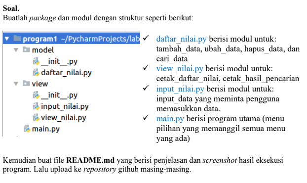
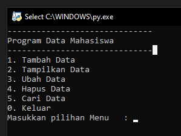
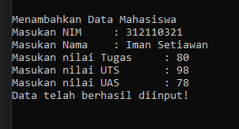
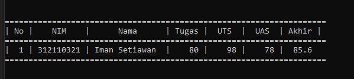
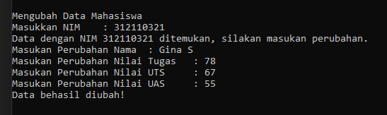
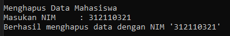
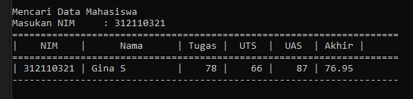

# Iman Setiawan
# TI.21.A1

**Tugas Ujian Akhir Semester**

Soal dari UAS.\

Menggunakan Package pada Python
main.py
sub model
-daftar_nilai.py
sub view
-input_nilai.py
-view_nilai.py

Tampilan dari menu utama.\

Tampilan dari menu Tambah Data.\

Tampilan dari menu Menampilkan Data.\

Tampilan dari menu Mengubah Data.\

Tampilan dari menu Menghapus Data.\

Tampilan dari menu Mencari Data.\

